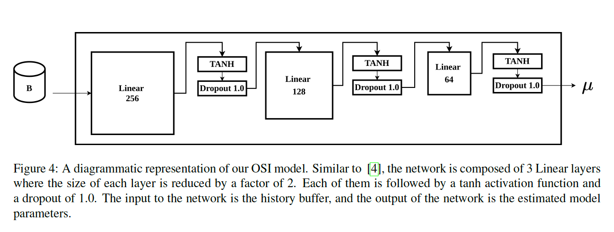
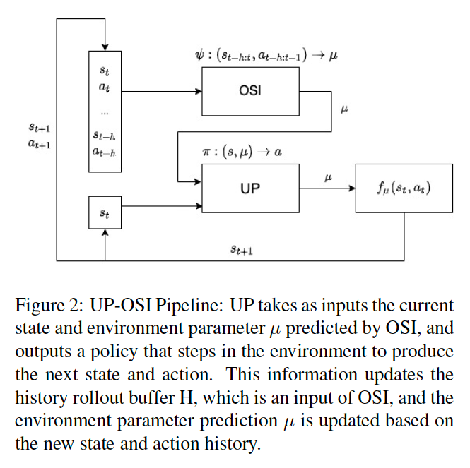

# 533VProject: Transfer learning on cart-pole
This is the github repository for a course project, Transfer Learning via Online System Identification, where we implemented an universal policy and an online system identification for the OpenAI [Cart-Pole](https://gym.openai.com/envs/CartPole-v0/) environment.

# Background

This is a course project based on this [paper](https://arxiv.org/abs/1702.02453). Our code base is Assignment 4 in the course [CPSC 533V](https://www.cs.ubc.ca/~van/cpsc533V/): Learning to Move. We first modified the cart-pole environment such that there are 4 dynamic evnironment parameters: gravity, cart mass, pole mass and pole length. These parameters are sampled from a uniform distribution from a reasonable range around the default value. Then, we implemented a universal policy with 30 set of environment, and evaluated this policy compared with a simple policy learnd on the original environment. 

After that, we implemented online system identifier as a supervised problem, and optimized the nerual network structure and parameters. Lastly we combined UP with OSI, and tested its performance in a range of environment parameters that has not been trained on. The UP-OSI system performs better than simple policy especially outside of the training range.

